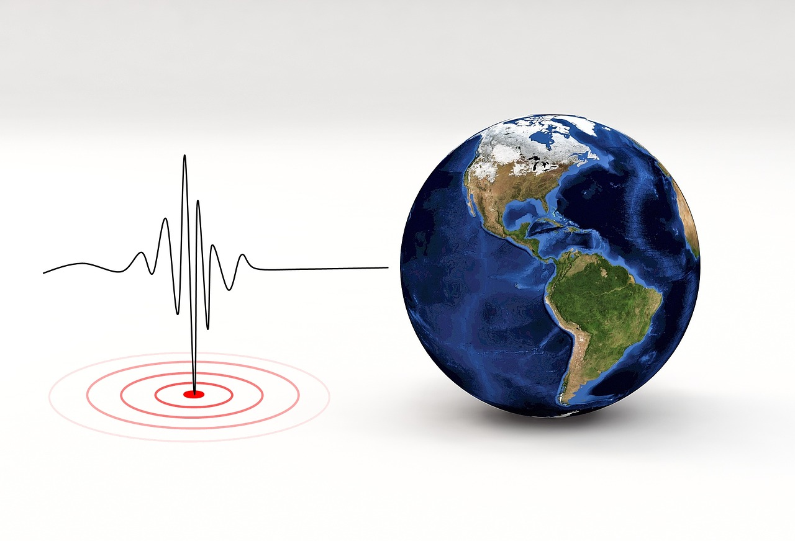

# Leaflet-Challenge

*Image by Tumisu Pixabay*

Using Leaflet to create a visual story using a geoJSON data set from United States Geological Survey, or USGS for short, about earthquakes.  This map reflects the magnitude and location of the earthquake with different sized and colored markers.

For additional functionality, a second data set was used to illustrate the relationship between tectonic plates and seismic activity using data found at https://github.com/fraxen/tectonicplates.

*Since this was helping me learn about making multi-functional maps, I wanted to elevate my coding game so it would benefit a group project in which I was designing the interactve map for as well.  The seemingly infinate zoom-out feature really bothered me as users could easily pan out and get lost, so this was corrected by adding a boundary variable.  Next, colors were changed to make the visualizations more appealing.  This made my header and data link incredibly plain and out of place, so I styled it with sticky header code to ensure it was always "floating" at the top of my page.  Finally, I scoured for code that would allow my screen to shake every so often so it would mimic the shaking of an earthquake.  The map did not want to function, so I had to settle for the data link to shake when you hover over it.  Overall, I was highly motivated to explore creating this webpage above and beyond it's basic concept as I feel this is the type of code that I'm drawn to.*  

Enjoy exploring my eartquake map at: https://tbbsparks.github.io/Leaflet-Challenge/

Interested in shake code?  Highly recommend this Github page.  When I grow up, I want to have repositories like this coder: https://elrumordelaluz.github.io/csshake/
